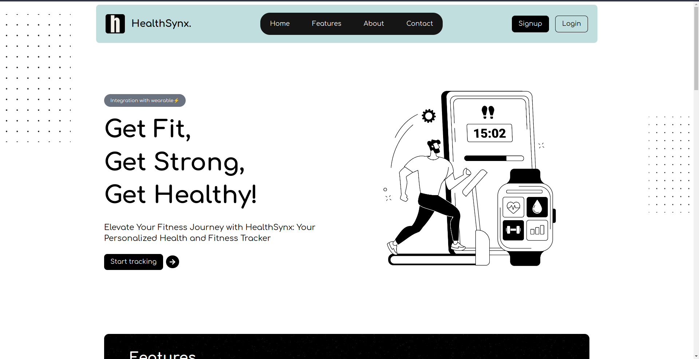
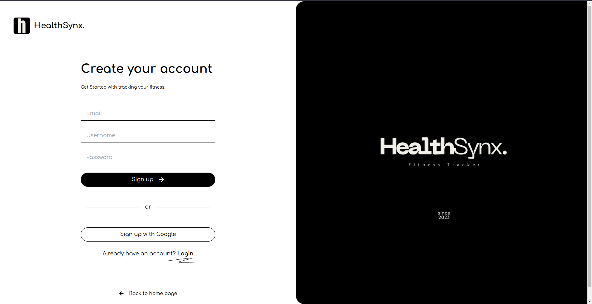
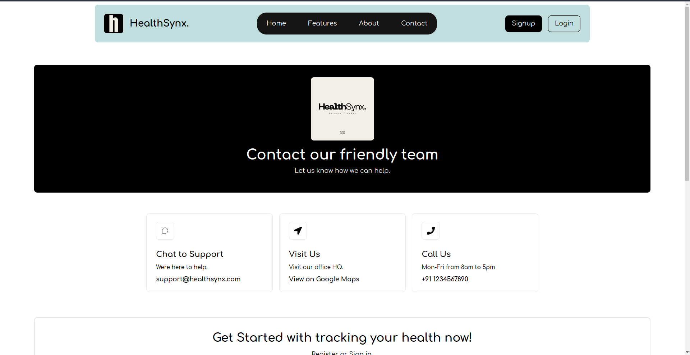
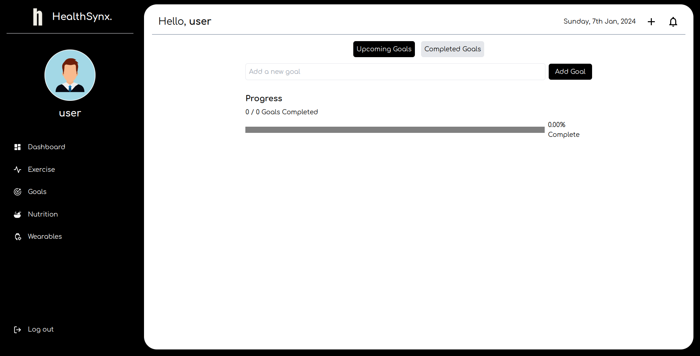
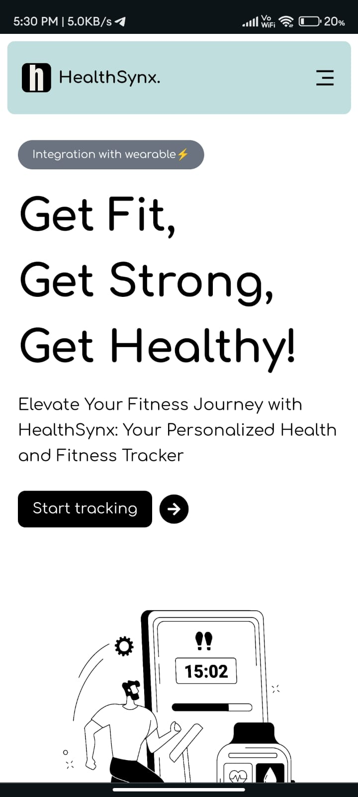
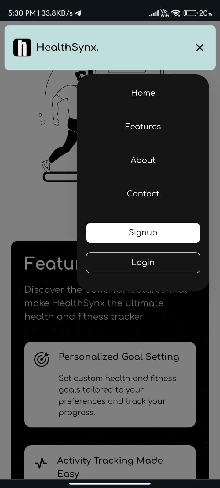
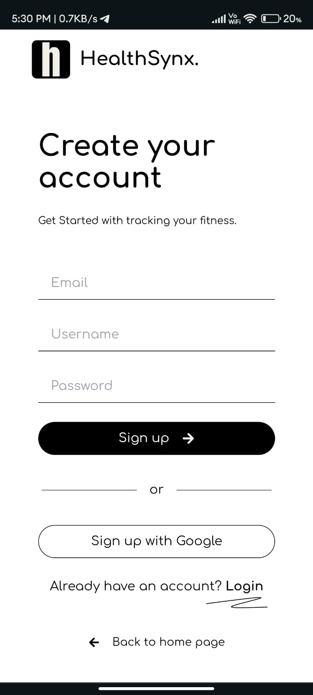
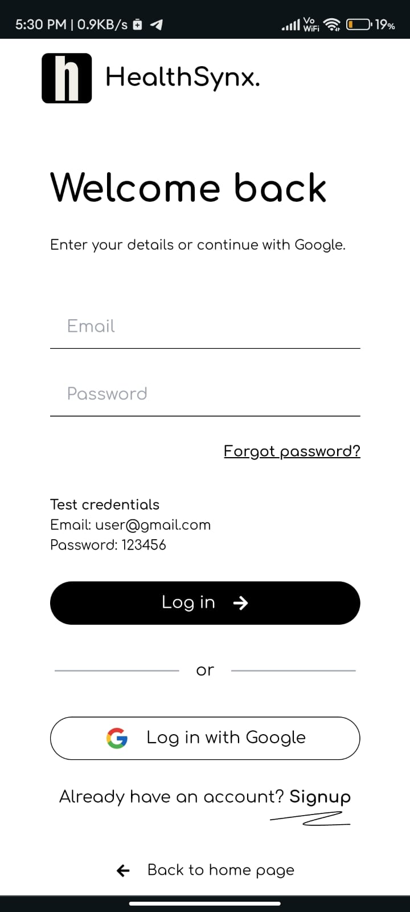

<h1 align="center"> HealthSynx. </h1>
<p align="center">
  
</p>

#### HealthSynx is an innovative health and fitness tracker web application that empowers users to lead healthier lives. With seamless integration with wearable devices and personalized goal setting, HealthSynx provides comprehensive insights and tracking capabilities.

## Technology used: 


## Features

- Personalized Goal Setting: Set custom health and fitness goals tailored to your preferences and track your progress.
- Nutritional Insights: Track meals, monitor calorie intake, and make informed choices for a balanced diet.
- User-Friendly Interface: Enjoy a sleek and intuitive interface for seamless navigation and quick access to information.

## Features to be implemented
- Seamless Integration with Fitness Wearables: Connect and sync data from your favorite fitness wearables for a comprehensive view of your well-being.
- Dashboard to be made responsive
- Google login and dark mode

## Screenshots: 

### Desktop View:

<table>
  <tr>
    <td>
      
    </td>
    <td>
      
    </td>
  </tr>
  <tr>
    <td>
      
    </td>
    <td>
      
    </td>
  </tr>
</table>

### Mobile View:
<table>
  <tr>
    <td>
      
    </td>
    <td>
      
    </td>
  </tr>
  <tr>
    <td>
      
    </td>
    <td>
      
    </td>
  </tr>
</table>

## Project Setup

1. **Clone the Repository:**

   ```bash
   git clone https://github.com/adityaj07/healthsynx.git
   cd healthsynx

2. **Navigate to frontend folder and install all the dependencies and run the frontend server**:
    
    ```bash
    cd frontend
    pnpm install
    pnpm run dev
    ```
3. **Now navigate to the backend folder and setup the environment variables**:
    ```
    cd backend
    ```
    - Copy the .env.example file and create a new file named .env.
    - Update the variables in the .env file with your specific configuration.

4. **Install the dependencies and run the backend server**:
    ```
    pnpm install
    pnpm run dev

- Recommended ports for 
    - frontend: 5173
    - backend: 3000